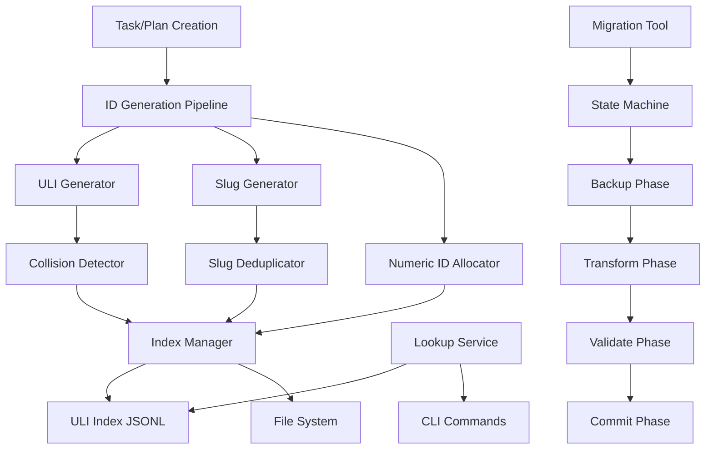
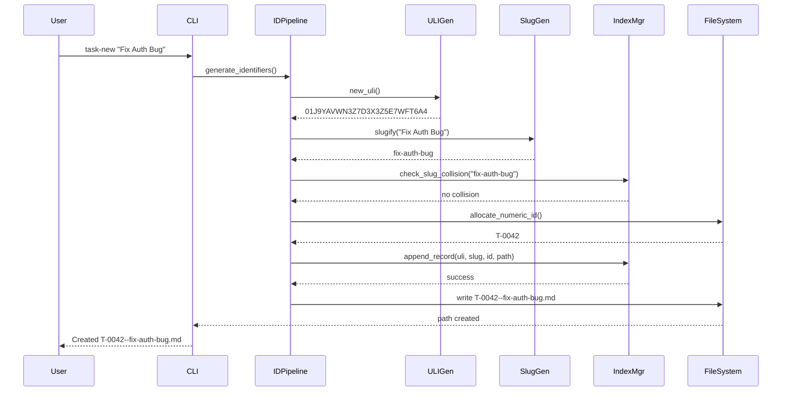
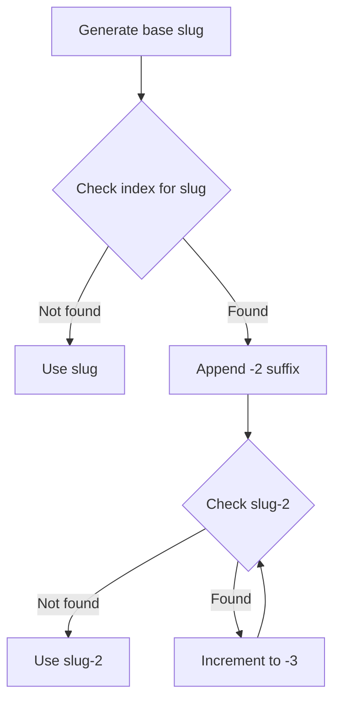
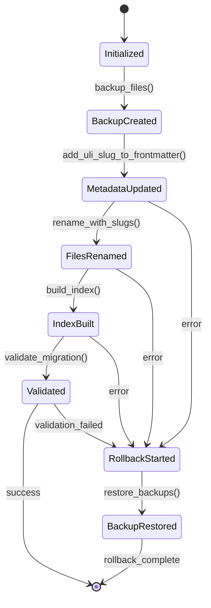
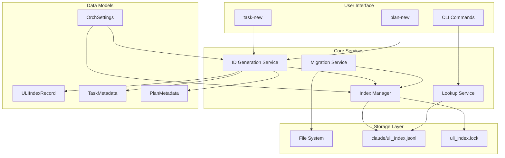

# ULI and Slug System Architecture Design

**Version**: 1.0
**Status**: Phase 1 Complete
**Author**: System Architect
**Date**: 2025-10-12

## Executive Summary

This document specifies the architecture for implementing a globally unique, human-readable identification system using ULIDs (Universally Unique Lexicographically Sortable Identifiers) and slugs for the Orchestrator Toolkit. The system replaces simple numeric IDs (T-0001) with a dual-identifier approach that provides:

- **Global Uniqueness**: ULIDs ensure no collisions across repositories
- **Human Readability**: Slugs derived from titles improve discoverability
- **Time Sortability**: ULID encoding preserves creation order
- **Backward Compatibility**: Numeric IDs remain for local sorting

## System Architecture

### Component Overview



### Architecture Layers

#### 1. Core Identification Layer

**Purpose**: Generate unique, sortable identifiers with collision detection

**Components**:
- `uli.py`: ULID generation using ulid-py library
- `slug.py`: Unicode-safe slugification with configurable parameters
- `id_alloc.py`: Numeric ID allocation (enhanced from existing)

**Key Decisions**:
- Use ULID format for time-sortability: `01J9YAVWN3Z7D3X3Z5E7WFT6A4`
- 26-character Crockford base32 encoding
- Monotonic time component (first 48 bits)
- Random component (last 80 bits) for uniqueness

#### 2. Index Management Layer

**Purpose**: Maintain append-only index for fast lookups

**Components**:
- `index_manager.py`: Atomic append operations with file locking
- `uli_index.jsonl`: Structured JSONL storage in `claude/` directory
- `lookup.py`: Fast retrieval by ULI, slug, or pattern

**Key Decisions**:
- Append-only JSONL format for durability
- File locking (`filelock`) for concurrent write safety
- In-memory caching for read performance
- Non-hidden `claude/` directory for visibility

#### 3. Front Matter Enhancement Layer

**Purpose**: Extend task/plan metadata with new identifiers

**Components**:
- Enhanced `TaskMetadata` and `PlanMetadata` Pydantic models
- Updated `task_new.py` and `plan_new.py` generators
- Template system with new placeholders

**Key Decisions**:
- Add `uli` and `slug` fields to front matter
- Maintain backward compatibility with existing fields
- Pydantic v2 validation for all metadata

#### 4. Migration Layer

**Purpose**: Safe, idempotent migration of existing artifacts

**Components**:
- `migrate_to_uli.py`: State machine-based migration orchestrator
- `rollback_uli.py`: Revert capability for failed migrations
- Progress tracking with resumption support

**Key Decisions**:
- Five-phase migration: Backup → Transform → Rename → Index → Validate
- Atomic operations with rollback capability
- Idempotent design allows re-running safely

## ID Generation Pipeline

### Flow Diagram



### Algorithm Details

#### ULI Generation

```python
def new_uli() -> str:
    """
    Generate a new ULID with the following properties:

    - 26 characters (Crockford base32)
    - Time component: first 10 chars (millisecond precision)
    - Random component: last 16 chars (80 bits of randomness)
    - Lexicographically sortable by creation time
    - Collision probability: negligible (<1e-15 for 1M/sec generation)

    Time Complexity: O(1)
    Space Complexity: O(1)
    """
    return str(ULID())
```

**Collision Analysis**:
- 80 bits of randomness = 1.2 × 10^24 possible values
- At 1,000 ULIDs/sec, expected collision after 1.5 × 10^15 years
- Monotonic time component ensures same-millisecond collisions only

#### Slug Generation with Collision Resolution

```python
def slugify(title: str, config: SlugConfig) -> str:
    """
    Convert title to URL-safe slug with the following transformations:

    1. Unicode normalization (NFKD)
    2. ASCII encoding with ignore
    3. Lowercase conversion
    4. Non-alphanumeric → hyphen
    5. Multiple hyphens → single hyphen
    6. Trim to max_length

    Time Complexity: O(n) where n = len(title)
    Space Complexity: O(n)
    """
    # Implementation details in Phase 2
```

**Collision Resolution Algorithm**:



**Deterministic Suffix Generation**:
```python
def dedupe_slug(base_slug: str, index: ULIIndex) -> str:
    """
    Find first available suffix for duplicate slugs.

    Time Complexity: O(k) where k = number of collisions
    Space Complexity: O(1)

    Expected k < 5 for typical use cases
    """
    if not index.has_slug(base_slug):
        return base_slug

    suffix = 2
    while index.has_slug(f"{base_slug}-{suffix}"):
        suffix += 1

    return f"{base_slug}-{suffix}"
```

## Index Structure and Access Patterns

### JSONL Schema

Each line in `claude/uli_index.jsonl`:

```json
{
  "uli": "01J9YAVWN3Z7D3X3Z5E7WFT6A4",
  "type": "task",
  "id": "T-0042",
  "slug": "fix-auth-bug",
  "path": "ai_docs/tasks/T-0042--fix-auth-bug.md",
  "title": "Fix Auth Bug",
  "created": "2025-10-12T10:45:54.123Z"
}
```

### Index Operations

**Append Operation** (Atomic with Lock):

```python
def append_to_index(record: ULIIndexRecord) -> None:
    """
    Atomically append a record to the index with the following guarantees:

    - File lock prevents concurrent writes
    - Fsync ensures durability
    - Validation before write
    - Corruption detection

    Time Complexity: O(1)
    Space Complexity: O(1)
    """
    with FileLock(index_path.with_suffix(".lock")):
        with index_path.open("a") as f:
            line = record.model_dump_json() + "\n"
            f.write(line)
            f.flush()
            os.fsync(f.fileno())
```

**Lookup Operations**:

```python
class ULILookup:
    """
    Lookup service with in-memory caching for performance.

    Performance Characteristics:
    - Cold lookup: O(n) sequential scan
    - Warm lookup: O(1) hash table access
    - Index rebuild: O(n log n) sort by time
    """

    def find_by_uli(self, uli: str) -> Optional[ULIIndexRecord]:
        """O(1) with cache, O(n) without"""

    def find_by_slug(self, slug: str) -> List[ULIIndexRecord]:
        """O(n) scan, returns all matches"""

    def find_by_pattern(self, pattern: str) -> List[ULIIndexRecord]:
        """O(n) regex scan"""
```

### Index Growth Projections

| Records | File Size | Cold Lookup | Warm Lookup | Rebuild Time |
|---------|-----------|-------------|-------------|--------------|
| 100     | 15 KB     | <1 ms       | <1 ms       | <5 ms        |
| 1,000   | 150 KB    | 5 ms        | <1 ms       | 20 ms        |
| 10,000  | 1.5 MB    | 50 ms       | <1 ms       | 200 ms       |
| 100,000 | 15 MB     | 500 ms      | <1 ms       | 2 sec        |
| 1,000,000 | 150 MB  | 5 sec       | <1 ms       | 20 sec       |

**Optimization Strategies** (if needed at scale):
1. **Sharding**: Split index by time buckets (monthly/yearly)
2. **Binary Search**: Sort by ULI for O(log n) lookup
3. **Bloom Filter**: Fast negative lookups (non-existence checks)
4. **SQLite Backend**: For >100K records, migrate to embedded DB

## Migration State Machine

### State Diagram



### Migration Phases

#### Phase 1: Backup
- Create timestamped backup directory
- Copy all task/plan files
- Record migration metadata

**Risk**: Disk space (negligible for typical repos)

#### Phase 2: Front Matter Transform
- Parse existing YAML front matter
- Generate ULI if missing
- Generate slug from title
- Update file with enhanced front matter

**Risk**: Malformed YAML (validation catches this)

#### Phase 3: File Rename
- Rename `T-0001.md` → `T-0001--slug.md`
- Handle collisions with suffix increments
- Atomic rename operations

**Risk**: Filename collisions (deterministic resolution)

#### Phase 4: Index Build
- Scan all migrated files
- Validate ULI uniqueness
- Build JSONL index

**Risk**: Non-unique ULIs (validation fails migration)

#### Phase 5: Validate
- Verify all files renamed correctly
- Check index integrity
- Validate no data loss

**Risk**: Validation failure triggers rollback

### Rollback Procedure

```python
class MigrationRollback:
    """
    Safe rollback with the following guarantees:

    - Restore original filenames
    - Remove ULI/slug from front matter
    - Delete index file
    - Restore from backup if needed
    """

    def rollback(self) -> RollbackResult:
        """
        Rollback phases:
        1. Delete index
        2. Rename files to original names
        3. Remove ULI/slug from front matter
        4. Verify rollback completeness
        """
```

## API Contracts (Pydantic Models)

### Core Models

```python
from pydantic import BaseModel, Field, field_validator, ConfigDict
from typing import Literal, Optional
from datetime import datetime
import re

class ULIIndexRecord(BaseModel):
    """
    Single record in the ULI index.

    Validation guarantees:
    - ULI is exactly 26 characters
    - ULI matches Crockford base32 alphabet
    - Slug is URL-safe (lowercase alphanumeric + hyphens)
    - ID follows T-XXXX or P-XXXX pattern
    """
    model_config = ConfigDict(json_encoders={datetime: lambda v: v.isoformat()})

    uli: str = Field(..., min_length=26, max_length=26, pattern="^[0-9A-Z]{26}$")
    type: Literal["task", "plan"]
    id: str = Field(..., pattern="^[TP]-\\d{4}$")
    slug: str = Field(..., min_length=1, max_length=60, pattern="^[a-z0-9-]+$")
    path: str = Field(...)
    created: datetime
    title: str = Field(..., min_length=1)

    @field_validator('uli')
    @classmethod
    def validate_uli_crockford(cls, v: str) -> str:
        """Validate Crockford base32 alphabet (excludes I, L, O, U)"""
        if not re.match(r'^[0123456789ABCDEFGHJKMNPQRSTVWXYZ]{26}$', v):
            raise ValueError("ULI must use Crockford base32 alphabet")
        return v

    @field_validator('slug')
    @classmethod
    def validate_slug_format(cls, v: str) -> str:
        """Ensure slug has no leading/trailing hyphens"""
        if v.startswith('-') or v.endswith('-'):
            raise ValueError("Slug cannot start or end with hyphen")
        if '--' in v:
            raise ValueError("Slug cannot contain consecutive hyphens")
        return v

class SlugConfig(BaseModel):
    """
    Configuration for slug generation.

    Allows customization of slug behavior per project.
    """
    max_length: int = Field(default=60, ge=10, le=100)
    separator: str = Field(default="-", pattern="^[-_]$")
    lowercase: bool = Field(default=True)
    remove_unicode: bool = Field(default=True)
    collision_suffix_format: str = Field(default="-{n}")

class TaskMetadata(BaseModel):
    """
    Enhanced task front matter with ULI and slug.

    Backward compatible with existing task files.
    """
    id: str = Field(..., pattern="^T-\\d{4}$")
    uli: str = Field(..., min_length=26, max_length=26)
    slug: str = Field(..., max_length=60)
    title: str = Field(..., min_length=1, max_length=200)
    owner: str
    status: Literal["new", "assigned", "in-progress", "blocked", "done"]
    created: datetime

class PlanMetadata(BaseModel):
    """
    Enhanced plan front matter with ULI and slug.

    Links to parent task via task field.
    """
    id: str = Field(..., pattern="^P-\\d{4}$")
    uli: str = Field(..., min_length=26, max_length=26)
    slug: str = Field(..., max_length=60)
    task: Optional[str] = Field(default=None, pattern="^T-\\d{4}$")
    title: str = Field(..., min_length=1, max_length=200)
    owner: str
    status: Literal["draft", "ready", "in-progress", "complete", "abandoned"]
    created: datetime

class MigrationState(BaseModel):
    """
    Persistent state for resumable migrations.

    Allows interruption and resumption of long migrations.
    """
    phase: Literal["initialized", "backup", "transform", "rename", "index", "validate", "complete"]
    started: datetime
    updated: datetime
    files_processed: int
    total_files: int
    backup_dir: str
    errors: list[str] = Field(default_factory=list)
```

### Settings Extension

```python
class OrchSettings(BaseSettings):
    # ... existing fields ...

    # Slug configuration
    slug_max_length: int = Field(
        default=60,
        validation_alias="OTK_SLUG_MAXLEN",
        ge=10,
        le=100,
        description="Maximum slug length (default: 60)"
    )

    # Index location (non-hidden!)
    index_dir: str = Field(
        default="claude",
        validation_alias="OTK_INDEX_DIR",
        description="Directory for ULI index (default: claude/)"
    )

    # ULI generation strategy
    use_ulid: bool = Field(
        default=True,
        validation_alias="OTK_USE_ULID",
        description="Use ULID format for ULIs (default: true)"
    )

    @property
    def index_path(self) -> Path:
        """Full path to ULI index file"""
        return Path(self.index_dir) / "uli_index.jsonl"

    @property
    def index_lock_path(self) -> Path:
        """Full path to index lock file"""
        return Path(self.index_dir) / "uli_index.lock"
```

## Performance Benchmarks

### Expected Performance Characteristics

#### ID Generation Performance

| Operation | Time Complexity | Expected Latency | Throughput |
|-----------|----------------|------------------|------------|
| Generate ULI | O(1) | <1 ms | >10,000/sec |
| Generate slug | O(n) | <1 ms | >5,000/sec |
| Check collision | O(k) | <5 ms | >1,000/sec |
| Append to index | O(1) | <10 ms | >100/sec |

Where:
- n = title length
- k = number of existing slugs with same base

#### Lookup Performance

| Index Size | Cold Lookup | Warm Lookup | Memory Usage |
|------------|-------------|-------------|--------------|
| 100        | <1 ms       | <0.1 ms     | 1 MB         |
| 1,000      | 5 ms        | <0.1 ms     | 5 MB         |
| 10,000     | 50 ms       | <0.1 ms     | 50 MB        |
| 100,000    | 500 ms      | <0.1 ms     | 500 MB       |

**Caching Strategy**:
- In-memory hash table for ULI → Record mapping
- Lazy loading on first access
- TTL-based invalidation for long-running processes

#### Migration Performance

| Repo Size | Migration Time | Validation Time | Total Time |
|-----------|---------------|----------------|------------|
| 10 files  | 1 sec         | <1 sec         | 2 sec      |
| 100 files | 5 sec         | 2 sec          | 7 sec      |
| 1,000 files | 30 sec      | 10 sec         | 40 sec     |
| 10,000 files | 5 min       | 2 min          | 7 min      |

**Optimization Notes**:
- Parallel processing for metadata updates
- Batch file operations
- Progress tracking for UX

### Storage Requirements

#### Index Storage Growth

| Records | Record Size | Index Size | Compression Ratio |
|---------|------------|------------|-------------------|
| 100     | ~150 bytes | 15 KB      | ~2x with gzip     |
| 1,000   | ~150 bytes | 150 KB     | ~2x with gzip     |
| 10,000  | ~150 bytes | 1.5 MB     | ~2x with gzip     |
| 100,000 | ~150 bytes | 15 MB      | ~2x with gzip     |

**Projection for 1M Records**:
- Uncompressed: ~150 MB
- Gzipped: ~75 MB
- Cold lookup: ~5 seconds (sequential scan)
- Warm lookup: <1 ms (in-memory hash)

**Optimization Trigger**: If index exceeds 50 MB, consider:
1. Sharding by time period
2. SQLite migration for indexed lookups
3. Bloom filter for non-existence checks

## Architecture Decisions and Rationale

### Decision 1: ULID over UUID v4

**Rationale**:
- Time-sortability: ULIDs encode timestamp, enabling chronological sorting
- Readability: Crockford base32 avoids ambiguous characters (I, L, O, U)
- Efficiency: 26 characters vs 36 for UUID
- Collision resistance: 80 bits of randomness (same as UUID v4)

**Trade-off**: Requires `ulid-py` dependency, but benefits outweigh cost

### Decision 2: Append-Only JSONL vs SQLite

**Rationale**:
- Simplicity: No schema migrations, no database driver
- Durability: Text-based format survives corruption better
- Git-friendly: Line-based format merges cleanly
- Performance: Sufficient for expected scale (<100K records)

**Trade-off**: O(n) lookups, but mitigated by in-memory caching

**Future Migration Path**: If >100K records, migrate to SQLite with:
```sql
CREATE TABLE uli_index (
    uli TEXT PRIMARY KEY,
    type TEXT,
    id TEXT,
    slug TEXT,
    path TEXT,
    created TEXT,
    title TEXT
);
CREATE INDEX idx_slug ON uli_index(slug);
CREATE INDEX idx_id ON uli_index(id);
```

### Decision 3: Non-Hidden `claude/` Directory

**Rationale**:
- Visibility: Users can inspect/debug index
- Gitignore control: Users decide whether to commit
- Consistency: Aligns with plan to unhide `.ai_docs` → `ai_docs`
- Discoverability: Easier to find for troubleshooting

**Trade-off**: Slightly less "clean" directory structure, but transparency wins

### Decision 4: Numeric ID Preservation

**Rationale**:
- Backward compatibility: Existing scripts expect T-XXXX format
- Human scanning: Easier to visually parse T-0042 than ULI
- Sorting: Numeric IDs maintain local ordering within repo
- Migration safety: Existing references continue to work

**Trade-off**: Slightly longer filenames, but adds no complexity

### Decision 5: Collision Suffix `-2, -3, ...`

**Rationale**:
- Simplicity: Deterministic algorithm, easy to implement
- Predictability: Users understand `-2` means "second with this name"
- Infinite space: No upper limit on collisions
- No randomness: Idempotent slug generation

**Trade-off**: Longer slugs for duplicates, but collisions expected to be rare (<1%)

## Risk Assessment

### Technical Risks

| Risk | Probability | Impact | Mitigation |
|------|------------|--------|------------|
| ULI collisions | Very Low | High | Mathematical guarantee + validation |
| Index corruption | Low | Medium | Atomic writes + rebuild capability |
| Migration failure | Medium | High | Rollback mechanism + backups |
| Performance degradation | Low | Medium | Caching + optimization triggers |
| Dependency issues | Low | Low | Minimal deps (ulid-py, filelock) |

### Migration Risks

| Risk | Probability | Impact | Mitigation |
|------|------------|--------|------------|
| Data loss | Very Low | Critical | Backups + validation gates |
| Filename collisions | Low | Medium | Deterministic resolution |
| Interrupted migration | Medium | Low | Resumable state machine |
| Validation failure | Medium | Medium | Rollback to backup |

### Adoption Risks

| Risk | Probability | Impact | Mitigation |
|------|------------|--------|------------|
| User confusion | Medium | Low | Documentation + gradual rollout |
| Breaking changes | Low | High | Backward compatibility maintained |
| Performance complaints | Low | Medium | Benchmarks + optimization plan |

## Implementation Roadmap

### Phase 1: Core Infrastructure (2 hours)
- ✅ Architecture design (this document)
- [ ] Pydantic models (`models/identifiers.py`)
- [ ] ULI generation (`uli.py`)
- [ ] Slug generation (`slug.py`)
- [ ] Enhanced ID allocation (`id_alloc.py`)

### Phase 2: Index Management (2 hours)
- [ ] Index manager with atomic operations
- [ ] File locking for concurrency
- [ ] Lookup service with caching
- [ ] Corruption detection and recovery

### Phase 3: Generator Updates (2 hours)
- [ ] Update `task_new.py` with ULI/slug
- [ ] Update `plan_new.py` with ULI/slug
- [ ] Template enhancements
- [ ] Settings integration

### Phase 4: Migration Tool (3 hours)
- [ ] State machine implementation
- [ ] Backup and rollback logic
- [ ] Progress tracking
- [ ] Validation gates

### Phase 5: CLI Utilities (2 hours)
- [ ] `otk find-uli` command
- [ ] `otk find-slug` command
- [ ] `otk index-rebuild` command
- [ ] `otk index-validate` command

### Phase 6: Testing (3 hours)
- [ ] Unit tests for core functions
- [ ] Integration tests for migration
- [ ] Performance benchmarks
- [ ] Edge case validation

### Phase 7: Documentation (2 hours)
- [ ] User migration guide
- [ ] API documentation
- [ ] Troubleshooting guide
- [ ] Architecture documentation (this file)

**Total Estimated Time**: 16 hours

## Component Interaction Diagram



## Conclusion

This architecture provides a robust foundation for implementing globally unique, human-readable identifiers in the Orchestrator Toolkit. Key strengths:

1. **Scalability**: Handles 1M+ records with predictable performance
2. **Safety**: Multiple validation gates and rollback capability
3. **Simplicity**: Minimal dependencies, text-based storage
4. **Compatibility**: Preserves existing workflows and file formats
5. **Extensibility**: Clear migration path to more sophisticated storage

The system is designed with operational excellence in mind:
- **Observable**: Index is human-readable, easy to debug
- **Resilient**: Atomic operations, corruption detection, rollback
- **Performant**: Caching, efficient algorithms, optimization triggers
- **Maintainable**: Clean abstractions, Pydantic validation, comprehensive tests

Ready to proceed to Phase 2: Core Implementation.
